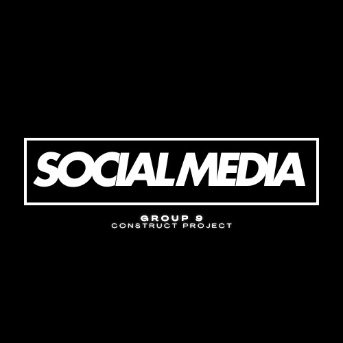

# Time Wasters on Social Media
**This project analyzes patterns and behaviors of social media usage to identify trends that could indicate excessive time spent on platforms. The analysis is presented through a Streamlit dashboard with various interactive visualizations**.
# Introduction
This project examines user behavior on social media platforms, focusing on the factors contributing to time-wasting behaviors. By analyzing a dataset of 1,000 users, the study investigates various demographic and behavioral aspects, including age, gender, location, income, and profession. Key variables such as total time spent, number of sessions, scroll rate, and number of videos watched are explored to identify trends in social media usage. Additionally, user engagement, satisfaction, and productivity loss are measured alongside factors like self-control, addiction level, and watch reason to understand how these variables impact social media habits. This project aims to offer insights into the growing concern of time wastage on social media, providing a basis for strategies that can enhance digital well-being

# Project Motivation
**With the rise of social media usage, it's important to understand how much time is being spent on these platforms and whether it's leading to productivity loss or addiction. This project aims to shed light on these patterns through data analysis and visualization, enabling a deeper understanding of social media behaviors**

# Features
: Interactive visualizations powered by Streamlit

: Analysis of total time spent on social media throughout the day

:Comparison of social media engagement across age groups

:KDE plot showing addiction levels by age

:Trend analysis of engagement and addiction across different user demographics

# Data
The dataset contains anonymized user data and includes columns for gender, age, time spent on the platform, addiction levels, and engagement. The data has been grouped and processed for the purpose of this analysis
# Usage
***After running the Streamlit app, you'll be able to view the following insights:***

: Total Time Spent: A line chart showing the total time spent on the platform at different times of the day.

: Addiction Level by Age Group: A KDE plot visualizing addiction levels for various age groups.

: Addiction Level Over Age: Line plot depicting how addiction levels change across age.

: Engagement Trend Over Age: Visualizes the trend of user engagement as age increases.

: Comparison of Platforms by Age Group and Gender: Shows a comparison of platforms usage segmented by age group and gender.
# Goals of the Project

Identify patterns of excessive social media usage.

Determine the addiction level across different age groups.

Analyze the correlation between age and engagement on various platforms.

Provide insights into how users can manage their time better on social media.

# Visualizations
The Streamlit dashboard contains the following visualizations:


# Directory Structure
Here is the structure of the project:

```bash
time-wasters-on-social-media/
│
├── social_media_usage.csv                         
│
├── Pages/                 
│   ├── Homepage.py        
│   ├── 1_Time_Wasters.py        
│   ├── 2_Engagement_Levels.py        
│   └── 3_Addiction_Levels.py      
│
├── streamlit_run.py
```

# Key Files:
streamlit_run.py: Main entry point for the Streamlit app.

Homepage.py : Provides the Introduction to the project and helps us with the navigation of pages

1_Time_Wasters.py : Contains all the data, graphs, and key analysis regarding users using Social Media.

2_Engagement_Levels.py: Provides us with the engagement levels as per demographics of the user which depends on countries, gender, and areas they reside in, and concluding with the most common watch reasons.

3_Addiction_Levels.py: Provides us with the addiction levels as per demographics of the user which depends on countries, gender, and areas they reside in, and concluding with the most common watch reasons.

# Technologies
Python: Programming language

Streamlit: Dashboard framework

Pandas: Data manipulation

Matplotlib & Seaborn: Data visualization

Numpy: Data handling and computation

# Demo Video
Watch the demo video here 

# Project Report :
https://drive.google.com/file/d/1wOf03U4ZkDyS4hCVH7t94aK3zIj1NmJ4/view?usp=sharing

# Key Dates and Activities

## 1st October 2024:
- *Logo Creation*: Designed the project logo.
### Project Logo


- *GitHub Repository Setup*: Created the repository to document and share the project.

## 2nd October 2024:
- *Reading Datasets*: Imported relevant datasets into the project.
- *Data Merging*: Combined datasets as per project requirements.
- *Data Insights*: Extracted specific insights from different columns required for analysis.
- *Correlation Analysis*: Identified correlations between different columns to assess attribute dependencies.
- *Data Visualization*: Visualized key attributes to facilitate data-driven decisions.

## 3rd October 2024:
- *Extracting Insights*: Gaining valuable insights from merged datasets.
- *Data Visualization*: Employing appropriate visualization methods to present the data effectively.
- *Error Rectification*: Fixing errors related to datetime formats.
- *Streamlit Application*: Initiating the development of an interactive Streamlit app.

## 4th October 2024:
- *Key Insights Choosing*: Extracting key insights for dashboard building.
- *Streamlit Application*: Building all dashboard features and making it interactive.
- *Discussing Main Points*: Discussing main key points


## 5th october 2024:
- *Project report: https://drive.google.com/file/d/1wOf03U4ZkDyS4hCVH7t94aK3zIj1NmJ4/view?usp=sharing
---


